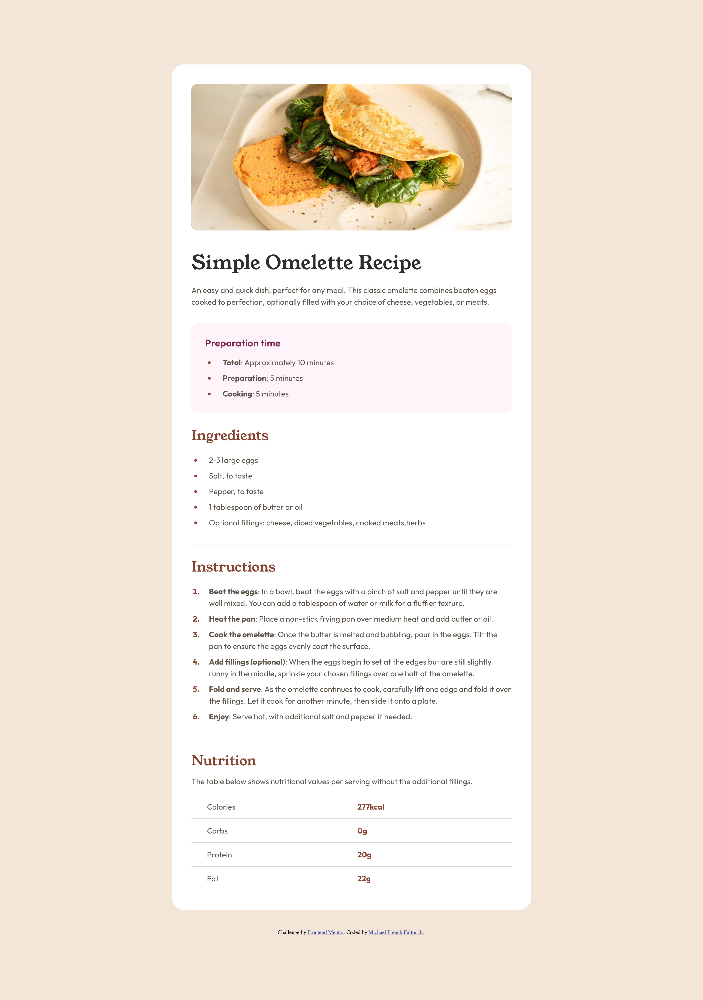
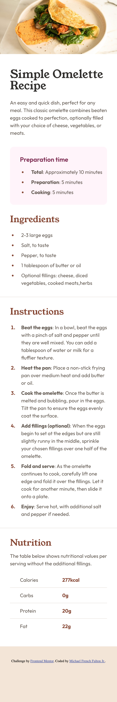

# Frontend Mentor - Recipe page solution

This is a solution to the [Recipe page challenge on Frontend Mentor](https://www.frontendmentor.io/challenges/recipe-page-KiTsR8QQKm). Frontend Mentor challenges help you improve your coding skills by building realistic projects. 

## Table of contents

- [Overview](#overview)
  - [The challenge](#the-challenge)
  - [Screenshot](#screenshot)
  - [Links](#links)
- [My process](#my-process)
  - [Built with](#built-with)
  - [Continued development](#continued-development)
  - [Useful resources](#useful-resources)
- [Author](#author)

## Overview

## The challenge

Build out this recipe page and get it looking as close to the design as possible.

### Screenshot

### Links

- Live Site URL: [GitHub Pages Site](https://frenchfulton94.github.io/Recipe-Page-Project/)

## My process

1. Determine the structure of the page.
2. Determine the proper semantic tags for the content.
3. Apply tags to the content.
4. Write out css for each part of the site usign the base tag.
5. Add classes for similar and resuable parts of the HTML.
6. Rewrite and reorganize CSS with the new classes.

### Built with

- Semantic HTML5 markup
- CSS custom properties
- Flexbox
- Mobile-first workflow

If you want more help with writing markdown, we'd recommend checking out [The Markdown Guide](https://www.markdownguide.org/) to learn more.

### Continued development

Going forward, improvemnts on this project would include better accessibility and site structrue for responsive layouts. Additionaly will revaluate for best practices.

### Useful resources

- [MDN](https://developer.mozilla.org/en-US/) - Used for css attributes and semantic usage of tags.

## Author

- Website - [Under Construction]()
- Frontend Mentor - [@frenchfulton94](https://www.frontendmentor.io/profile/frenchfulton94)